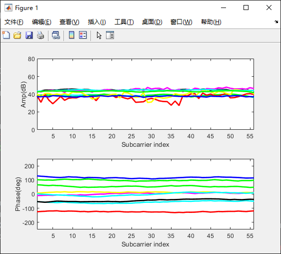

# Realtime-processing-for-csitool
This realtime processing tool is for Atheros-CSI-tool.

## In matlab:
```
read_bf_socket
```

## In Atheros Device:

refer to https://github.com/helloLycon/Atheros_CSI_tool_OpenWRT_UserSpaceApp_src for more details.
```
recvCSI [write-into] [ip:port]
```

\<ip\> is the ip address of the computer which runs the Matlab script, and \<port\> is 8090 by default.

## Screenshot

